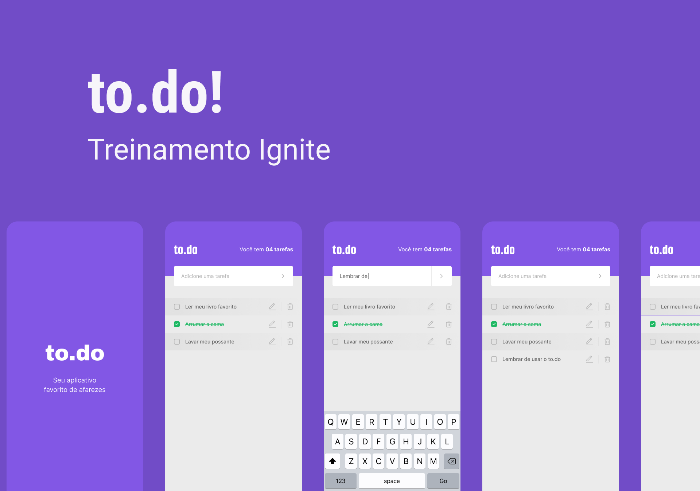

# to.do-Rocketseat
## O to.do é uma ótima alternativa para a listagem de atividades que precisam ser realizadas.
Ele fornece uma breve descrição da atividade a ser executada sendo a listagem exibida na ordem de criação.

<h1 align="center">
  ✅ to.do ✅
</h1>

<p align="center">
 <a href="#-sobre-o-projeto">Sobre</a> •
 <a href="#-layout">Layout</a> • 
 <a href="#-funcionalidade">Funcionalidades</a> • 	
 <a href="#-tecnologias">Tecnologias</a>  
</p>

---
## ⚙Sobre

Projeto trata de um aplicativo simples de listagem de tarefas onde a inserção de novas tarefas e a exclusão podem ser feitas na mesma tela. Onde o principal objetivo era a prátrica dos fundamentos do react native do curso da Rocketseat.

---


## 📱Aplicanção


  
---     

## 🎨Layout

O layout foi fornecido pala Rocketseat 
- [Figma](https://www.figma.com/file/rbj2heb8KmkOxA7ZkP9hRX/to.do?node-id=197%3A1480)

  --- 
  
### 🛠Tecnologias Utilizadas

As seguintes ferramentas foram usadas na construção do projeto:

- [TypeScript](https://www.typescriptlang.org/)
- [React Native](https://reactnative.dev/)

### 🛠Requisitos de software

- Instalar o [yarn](https://yarnpkg.com/)
- Instalar e configurar o [Android Studio](https://developer.android.com/studio)

---

<h1>
  Como utilizar ⚠️
</h1>

 <h3> Para rodar o projeto, basta executar os seguintes comandos, em seu terminal com git <h3/>
 

   Faça um clone do repositório
```
  git clone <link-do-repositório>
```
  # Navegue até a pasta do projeto e baixe as dependências<h3/>
```
  cd to-do && yarn
```
  # Rode o metro bundler<h3/>
```
  yarn start
```
  # E, em outro terminal, execute
```
  yarn android # ou yarn ios
```  
  
  
  ## 📝Licença
  <h4> Esse projeto se encontra sob a licença MIT. Para mais informações, acesse o arquivo LICENSE.</h4>
